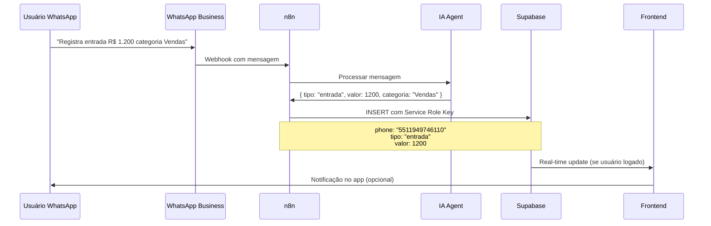

# Arquitetura de Integração: Supabase Auth + n8n + WhatsApp

## Visão Geral da Arquitetura Atual

Com base na análise do código e PRD, o sistema "Meu Agente" possui:

- **Frontend**: React/TypeScript com autenticação customizada via Edge Functions
- **Backend**: Supabase com RLS policies
- **Agentes IA**: Operando via WhatsApp para automação
- **Integrações**: Google Workspace (Calendar, Drive, Tasks, Gmail)
- **Automação**: n8n para processamento de dados externos

## Problema Identificado

O sistema atual usa **autenticação customizada** (Edge Functions) que não gera JWT tokens do Supabase Auth, causando incompatibilidade com RLS policies que dependem de `auth.uid()` e `request.jwt.claims`.

## Solução: Arquitetura Híbrida com Supabase Auth

### 1. Fluxos de Autenticação Diferenciados

#### A) Usuários Finais (Frontend)
```
Usuário → Supabase Auth → JWT Token → RLS Policies ✅
```

#### B) Agentes WhatsApp + n8n (Automação)
```
WhatsApp → n8n → Service Role Key → Bypass RLS ✅
```

### 2. Implementação Detalhada

#### Frontend: Migração para Supabase Auth

**Antes (Atual):**
```typescript
// AuthContext.tsx - Sistema customizado
const login = async ({ phone, password }) => {
  const response = await fetch(`${SUPABASE_URL}/functions/v1/auth-login`, {
    method: 'POST',
    headers: {
      'Authorization': `Bearer ${SUPABASE_KEY}`, // Anon key
    },
    body: JSON.stringify({ phone, password }),
  });
  // Não gera JWT do Supabase Auth
};
```

**Depois (Supabase Auth):**
```typescript
// AuthContext.tsx - Supabase Auth nativo
const login = async ({ phone, password }) => {
  // 1. Autenticar via Supabase Auth
  const { data, error } = await supabase.auth.signInWithPassword({
    email: `${phone}@meuagente.com`, // Converter phone para email
    password: password,
  });
  
  if (error) throw error;
  
  // 2. JWT token automaticamente gerenciado
  // 3. RLS policies funcionam automaticamente
  return data.user;
};
```

#### n8n + WhatsApp: Service Role para Automação

**Fluxo de Dados:**
```
1. WhatsApp recebe mensagem do usuário
2. n8n processa a mensagem
3. n8n identifica o usuário pelo telefone
4. n8n usa Service Role Key para inserir dados
5. Dados são associados ao usuário correto
```

**Exemplo de Workflow n8n:**
```javascript
// n8n Node: Processar Mensagem WhatsApp
const phoneNumber = $input.first().json.from; // Ex: 5511949746110
const message = $input.first().json.body;

// Processar com IA (financeiro, agenda, etc.)
const processedData = await processWithAI(message);

// Inserir no Supabase usando Service Role
const supabaseServiceRole = createClient(
  'https://teexqwlnfdlcruqbmwuz.supabase.co',
  'SERVICE_ROLE_KEY' // Chave com bypass de RLS
);

await supabaseServiceRole
  .from('financeiro_registros')
  .insert({
    phone: phoneNumber,
    tipo: processedData.tipo,
    categoria: processedData.categoria,
    valor: processedData.valor,
    descricao: processedData.descricao,
    // ... outros campos
  });
```

### 3. Configuração de RLS Policies

#### Para Usuários Autenticados (Frontend)
```sql
-- Policy para usuários com JWT válido
CREATE POLICY "authenticated_users_policy" ON financeiro_registros
FOR ALL USING (
  auth.uid() IS NOT NULL AND 
  phone = (auth.jwt() ->> 'phone')::text
);
```

#### Para Service Role (n8n/Automação)
```sql
-- Service Role bypassa RLS automaticamente
-- Não precisa de policy específica
```

### 4. Mapeamento Phone → Supabase Auth

#### Estratégia 1: Email Sintético
```typescript
// Converter telefone para email único
const phoneToEmail = (phone: string) => `${phone}@meuagente.com`;
const emailToPhone = (email: string) => email.replace('@meuagente.com', '');

// Signup
await supabase.auth.signUp({
  email: phoneToEmail(phone),
  password: password,
  options: {
    data: {
      phone: phone,
      name: name,
      // ... outros dados
    }
  }
});
```

#### Estratégia 2: Custom Claims no JWT
```sql
-- Trigger para adicionar phone no JWT
CREATE OR REPLACE FUNCTION public.handle_new_user()
RETURNS trigger AS $$
BEGIN
  INSERT INTO public.profiles (id, phone, name, email)
  VALUES (
    new.id,
    new.raw_user_meta_data->>'phone',
    new.raw_user_meta_data->>'name',
    new.email
  );
  RETURN new;
END;
$$ LANGUAGE plpgsql SECURITY DEFINER;

CREATE TRIGGER on_auth_user_created
  AFTER INSERT ON auth.users
  FOR EACH ROW EXECUTE PROCEDURE public.handle_new_user();
```

### 5. Configuração do Cliente Supabase

#### Frontend (User Auth)
```typescript
// supabase/client.ts
export const supabase = createClient(
  process.env.VITE_SUPABASE_URL!,
  process.env.VITE_SUPABASE_ANON_KEY!,
  {
    auth: {
      storage: window.localStorage, // Persistir sessão
      autoRefreshToken: true,
      persistSession: true,
    },
  }
);
```

#### n8n (Service Role)
```javascript
// n8n Workflow
const supabaseService = createClient(
  process.env.SUPABASE_URL,
  process.env.SUPABASE_SERVICE_ROLE_KEY // Bypass RLS
);
```

### 6. Fluxo Completo de Exemplo

#### Cenário: Usuário envia "Registra entrada R$ 1.200 categoria Vendas"



### 7. Vantagens da Arquitetura Híbrida

#### ✅ Segurança
- Frontend usa autenticação nativa do Supabase
- RLS policies protegem dados por usuário
- Service Role limitado apenas para automação

#### ✅ Escalabilidade
- JWT tokens gerenciados automaticamente
- Sessões persistentes no frontend
- n8n pode processar milhares de mensagens

#### ✅ Manutenibilidade
- Padrão de autenticação conhecido
- Menos código customizado
- Debugging mais fácil

### 8. Checklist de Implementação

#### Fase 1: Preparação
- [ ] Configurar Supabase Auth
- [ ] Criar tabela `profiles` para dados do usuário
- [ ] Configurar triggers para novos usuários

#### Fase 2: Frontend
- [ ] Migrar `AuthContext` para Supabase Auth
- [ ] Atualizar componentes de login/signup
- [ ] Testar fluxo de autenticação

#### Fase 3: RLS Policies
- [ ] Recriar policies para `auth.uid()`
- [ ] Testar acesso aos dados
- [ ] Validar segurança

#### Fase 4: n8n Integration
- [ ] Configurar Service Role Key no n8n
- [ ] Criar workflows para WhatsApp
- [ ] Testar inserção de dados

#### Fase 5: Testes
- [ ] Testar fluxo completo usuário → WhatsApp → n8n → Supabase
- [ ] Validar isolamento de dados por usuário
- [ ] Performance testing

### 9. Considerações de Segurança

#### Service Role Key
- Usar apenas em ambiente seguro (n8n server)
- Não expor no frontend
- Rotacionar periodicamente

#### Validação de Dados
```javascript
// n8n: Validar telefone antes de inserir
const isValidPhone = (phone) => /^\d{10,15}$/.test(phone);
if (!isValidPhone(phoneNumber)) {
  throw new Error('Invalid phone number');
}
```

#### Rate Limiting
- Implementar rate limiting no n8n
- Monitorar uso da Service Role Key
- Alertas para uso anômalo

## Conclusão

Esta arquitetura híbrida resolve o problema atual mantendo:
- **Segurança**: RLS policies funcionais para usuários
- **Automação**: Service Role para n8n/WhatsApp
- **Escalabilidade**: Padrões nativos do Supabase
- **Flexibilidade**: Suporte a diferentes fluxos de dados

A migração pode ser feita gradualmente, testando cada componente antes de ir para produção.